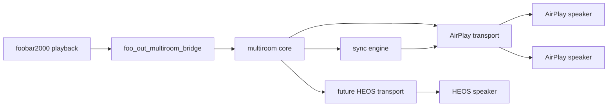

# Architecture

## Decision

Build a separate foobar2000 output component, `foo_out_multiroom_bridge`, with a
transport abstraction and a native AirPlay transport. The project should own
speaker discovery, pairing/auth, stream negotiation, timing, packet scheduling,
and synchronization.

## High Level Flow

## Component Boundaries

`foo_out_multiroom_bridge`

- Receives PCM from foobar as an output component.
- Converts/resamples to transport-supported stream format.
- Owns foobar UI commands and panels.
- Maintains selected output ids and presets.
- Talks only to transport interfaces, not to protocol internals.

`multiroom_core`

- Holds transport-neutral models: output id, name, type, selected state, volume,
  offset, auth state, supported formats, and capabilities.
- Owns retry/backoff, status caching, and event fanout.
- Defines a `Transport` interface.

`airplay_transport`

- Discovers AirPlay speakers.
- Opens AirPlay playback sessions.
- Negotiates stream format and authentication.
- Schedules timestamped audio packets.
- Applies per-output volume and offsets.

`sync_engine`

- Maintains the sender playback clock.
- Tracks per-device latency and drift.
- Gives each transport the timestamps and target buffer horizon it needs.

`heos_transport`

- Future transport using HEOS CLI/API.
- Should implement the same transport contract without changing foobar UI.

## Synchronization Model

The plugin should synchronize selected AirPlay speakers through its own sender
clock. AirPlay sync involves clock negotiation, packet timing, receiver latency,
retransmits, and device-specific behavior, so the sync engine must be developed
as a first-class module, not hidden inside UI code.

For local foobar/spatial playback plus AirPlay playback at the same time, there
are two viable modes:

1. Remote-primary mode: the plugin owns remote sync; local playback is disabled
   or treated as a separate, manually offset monitor.
2. Dual-output mode: foobar writes to local output and bridge output; the plugin
   exposes a local delay compensation setting. This is useful but should be v2,
   because foobar output fanout and latency measurement need care.

## Transport Contract

Every transport should support:

- `connect()`
- `disconnect()`
- `list_outputs()`
- `set_enabled_outputs(ids)`
- `set_output_volume(id, volume)`
- `set_output_offset_ms(id, offset_ms)`
- `open_pcm_stream(format)`
- `write_pcm(frames)`
- `flush()`
- `stop()`

Optional capabilities:

- output auth/pairing,
- output grouping,
- transport-side queue/playback state,
- metadata/artwork forwarding,
- latency measurement,
- per-output format selection.

## Why Not Extend The Spatial Renderer First

The spatial renderer is about channel/object rendering to one Windows endpoint.
Multiroom is about network transport, device discovery, group selection, and
clock synchronization. Keeping them separate avoids making the renderer depend
on AirPlay/HEOS concepts. Later, both can share a PCM source abstraction.
